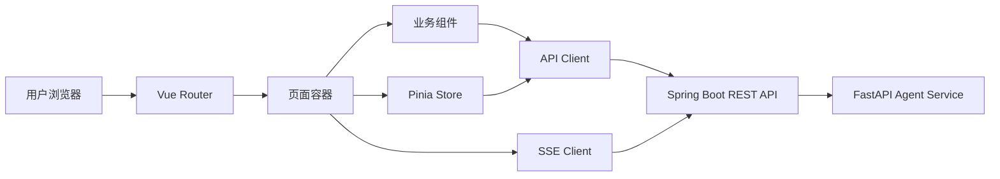

# MeetMate 前端技术架构设计

> 文档类型：前端技术架构  
> 适用项目：`fffflllll/yun-dp` 增量改造为 MeetMate  
> 技术方向：Vue 3 + TypeScript + Vite  
> 文档版本：v1.2

---

# 1. 文档目标

本文档定义 MeetMate Web 前端的技术架构、页面结构、状态管理、接口调用、SSE 实时进度、权限控制、错误处理、工程目录、测试策略和部署方案。

前端的核心任务不是简单增加一个聊天框，而是完整承载以下多人协商流程：

> **v1.1 修订（基于架构评审拍板）**：对齐 Java 侧冻结的四项决策（ADR-001~004）：
> - R1 澄清交互 —— 前端只通过 Java API 查询/作答 clarification，绝不直接调 Python resume；`WAITING_INPUT` SSE 事件携带结构化问题，前端按 `answerType` 渲染控件（见 §7.6、§7.10、ADR-002）；
> - R2 评分归属 —— 展示分数全部来自 Java，方案卡片不再依赖 Python 返回 score（见 ADR-001）；
> - R3 截止时间 —— 倒计时由 Java 状态驱动，前端只读展示（见 ADR-003）；
> - P1 投票冻结为多数制单选择 `SUPPORT` / `REJECT_ALL` / `ABSTAIN`，去掉排序投票 UI（见 §7.8、ADR-004）；
> - P1 FINALIZED 局部重规划经 `REPLAN_PENDING`，创建 `LOCAL_REPLAN` 任务，旧方案确认前保持有效（见 §7.4、§7.9）。
> - **v1.2 修订（基于二次评审）**：澄清契约收敛为 MVP 方案 A（`USER`/`OWNER`，群体澄清由 Java 为每位成员各建一条）；补充 Nginx SSE 反代配置（`proxy_buffering off` + 长 `proxy_read_timeout`，R8）；校正 `REPLAN_PENDING → FINALIZED` / `REPLANNING → FINALIZED` 恢复边引用。

1. 用户登录；
2. 创建或加入聚会房间；
3. 查看成员提交状态；
4. 输入自然语言偏好；
5. 确认 Agent 解析后的结构化偏好；
6. 查看 Agent 规划进度；
7. 对比候选方案；
8. 投票或提交否决理由；
9. 查看重规划结果；
10. 查看最终方案。

---

# 2. 改造原则

## 2.1 不继续扩展旧静态页面

现有前端采用：

- 单 HTML 页面；
- 页面内直接 `new Vue()`；
- Vue 2；
- Element UI；
- `location.href` 页面跳转；
- `sessionStorage` 保存 Token；
- Nginx 直接托管静态文件；
- 没有前端构建和模块化体系。

该方案适合教学 Demo，但不适合 MeetMate 的复杂状态与多人任务。

新前端采用独立工程：

```text
web/
```

旧页面暂时保留为：

```text
frontend-legacy/
```

迁移完成后再删除旧前端。

## 2.2 前端只调用 Java 后端

浏览器不得直接调用 Python Agent Service。

调用链：

```text
Vue Web
   │
   │ REST / SSE
   ▼
Spring Boot
   │
   │ 内部 REST
   ▼
FastAPI Agent Service
```

原因：

- 用户身份由 Java 统一校验；
- 房间权限由 Java 统一判断；
- Python 不暴露公网；
- Token 不传递给 Python；
- 所有 Agent 操作可审计；
- 避免前端绕过业务状态机。

## 2.3 前端不保存关键业务事实

前端状态只是服务端数据的视图和临时缓存。

以下信息必须以 Java 后端为准：

- 房间状态；
- 成员状态；
- 偏好确认状态；
- Agent Run 状态；
- 当前轮次；
- 投票结果；
- 最终方案；
- 房主权限。

---

# 3. 技术栈

## 3.1 基础技术

```text
Vue 3
TypeScript
Vite
Vue Router
Pinia
Element Plus
Axios
基于 fetch 的 SSE 客户端
```

## 3.2 辅助技术

```text
ESLint
Prettier
Vitest
Vue Test Utils
Playwright
Mock Service Worker 或等价 Mock 方案
```

## 3.3 不建议首期引入

- Nuxt；
- 微前端；
- GraphQL；
- WebSocket；
- 复杂低代码框架；
- 大型全局状态框架；
- 多套 UI 框架并存。

MVP 使用 REST + SSE 足够。

---

# 4. 总体架构



前端内部划分为：

```text
UI 层
  ├── 页面
  ├── 业务组件
  └── 通用组件

应用状态层
  ├── auth store
  ├── room store
  ├── preference store
  ├── planning store
  └── vote store

基础设施层
  ├── HTTP Client
  ├── SSE Client
  ├── Token 管理
  ├── 错误处理
  ├── 日志与埋点
  └── 路由守卫
```

---

# 5. 工程目录

```text
web/
├── public/
├── src/
│   ├── api/
│   │   ├── client.ts
│   │   ├── auth.ts
│   │   ├── room.ts
│   │   ├── member.ts
│   │   ├── preference.ts
│   │   ├── planning.ts
│   │   ├── proposal.ts
│   │   ├── vote.ts
│   │   ├── clarification.ts
│   │   └── profile.ts
│   ├── assets/
│   ├── components/
│   │   ├── common/
│   │   ├── room/
│   │   ├── preference/
│   │   ├── planning/
│   │   ├── proposal/
│   │   └── vote/
│   ├── composables/
│   │   ├── useAuth.ts
│   │   ├── useRoomPermission.ts
│   │   ├── useAgentStream.ts
│   │   ├── useCountdown.ts
│   │   └── useRequestState.ts
│   ├── layouts/
│   │   ├── AppLayout.vue
│   │   ├── AuthLayout.vue
│   │   └── RoomLayout.vue
│   ├── pages/
│   │   ├── auth/
│   │   ├── home/
│   │   ├── discover/
│   │   ├── room/
│   │   ├── preference/
│   │   ├── planning/
│   │   ├── proposal/
│   │   ├── vote/
│   │   ├── final-plan/
│   │   └── profile/
│   ├── router/
│   │   ├── index.ts
│   │   └── guards.ts
│   ├── stores/
│   │   ├── auth.ts
│   │   ├── room.ts
│   │   ├── preference.ts
│   │   ├── planning.ts
│   │   ├── vote.ts
│   │   └── clarification.ts
│   ├── types/
│   │   ├── api.ts
│   │   ├── auth.ts
│   │   ├── room.ts
│   │   ├── preference.ts
│   │   ├── planning.ts
│   │   ├── proposal.ts
│   │   └── vote.ts
│   ├── utils/
│   │   ├── error.ts
│   │   ├── format.ts
│   │   ├── storage.ts
│   │   └── validation.ts
│   ├── App.vue
│   └── main.ts
├── tests/
├── .env.example
├── Dockerfile
├── nginx.conf
├── package.json
├── tsconfig.json
└── vite.config.ts
```

---

# 6. 路由设计

```text
/login
/home
/discover

/rooms/new
/rooms/join
/rooms/:roomId
/rooms/:roomId/preferences
/rooms/:roomId/planning
/rooms/:roomId/proposals
/rooms/:roomId/vote
/rooms/:roomId/final

/profile
/profile/preferences
```

## 6.1 路由元信息

```ts
interface RouteMeta {
  requiresAuth?: boolean
  requiresRoomMember?: boolean
  requiresOwner?: boolean
  allowedRoomStatuses?: string[]
}
```

## 6.2 路由守卫

路由守卫只做前端体验控制，不代替后端权限校验。

流程：

```text
访问受保护页面
   ↓
检查 Token
   ↓
无 Token → /login
   ↓
有 Token → 获取当前用户
   ↓
进入房间页面时拉取房间详情
   ↓
检查是否成员、是否房主、状态是否允许
```

---

# 7. 页面信息架构

# 7.1 登录页

功能：

- 手机号输入；
- 获取验证码；
- 验证码登录；
- 登录后跳转原目标页面；
- 处理验证码倒计时；
- 防止重复点击。

状态：

```text
IDLE
SENDING_CODE
CODE_SENT
LOGGING_IN
SUCCEEDED
FAILED
```

---

# 7.2 首页

首页核心模块：

1. 创建聚会；
2. 输入邀请码；
3. 进行中的房间；
4. 待处理事项；
5. 最近完成；
6. 附近灵感；
7. 探店内容。

首页卡片应优先展示：

- 当前房间状态；
- 偏好提交进度；
- 当前 Agent 状态；
- 投票进度；
- 用户下一步动作。

示例：

```text
周六四人聚餐
3/4 人已确认偏好
截止时间：明天 18:00
你的状态：待确认
[继续填写]
```

---

# 7.3 创建房间页

表单字段：

```text
title
sceneType
dateOptions
areaHint
centerLocation
searchRadiusMeter
maxMembers
minSubmittedMembers
preferenceDeadline
votingDeadline
votingRule
allowMemberInvite
```

前端校验：

- 标题长度；
- 截止时间必须晚于当前时间；
- 投票截止不得早于偏好截止；
- 最大人数范围；
- 至少一个候选时间；
- 搜索半径范围；
- 防止重复提交。

创建请求必须携带：

```text
Idempotency-Key
```

---

# 7.4 房间大厅

展示：

- 房间标题；
- 房间状态；
- 邀请码；
- 分享链接；
- 成员头像；
- 成员偏好状态；
- 偏好截止时间；
- 当前轮次；
- Agent 状态；
- 房主操作；
- 用户当前可执行动作。

前端根据状态展示动作：

| 房间状态 | 普通成员 | 房主 |
|---|---|---|
| DRAFT | 查看 | 编辑、开始收集 |
| COLLECTING_PREFERENCES | 填写偏好 | 邀请、提醒、关闭收集 |
| READY_TO_PLAN | 查看 | 发起规划 |
| PLANNING | 查看进度 | 取消运行 |
| VOTING | 投票 | 查看统计、结束投票 |
| REPLANNING | 查看进度 | 取消运行 |
| REPLAN_PENDING | 查看统计、等待房主确认 | 确认重规划、放弃重规划 |
| FINALIZED | 查看最终方案 | 发起局部替换（LOCAL_REPLAN） |
| CANCELLED/EXPIRED | 只读 | 只读 |

---

# 7.5 偏好输入与确认页

页面分两步。

## 第一步：自然语言输入

输入示例：

```text
周六晚上七点以后都可以，预算最好不要超过 120 元。
不能吃特别辣，想吃烤肉或者日料，离地铁近一点。
```

操作：

- 保存草稿；
- 提交解析；
- 显示解析中；
- 解析失败可重试。

## 第二步：结构化确认

展示：

```text
可用时间
预算
饮食偏好
饮食禁忌
过敏
距离
交通
等待时间
环境偏好
备注
HARD / SOFT
```

用户可：

- 修改字段；
- 删除误识别项；
- 改 HARD/SOFT；
- 添加遗漏项；
- 确认提交。

只有用户确认后，偏好才算正式生效。

---

# 7.6 Agent 规划进度页

使用 SSE 展示业务阶段，不展示模型私有推理。

允许展示：

```text
正在读取 4 位成员的偏好
正在计算共同时间
发现 2 处偏好冲突
正在搜索附近候选店铺
已召回 38 家店铺
已通过硬约束筛选 9 家
正在计算群体满意度
正在生成 3 个差异化方案
方案已生成
```

不得展示：

- Chain of Thought；
- 内部 Prompt；
- 系统密钥；
- 原始工具认证信息；
- 不适合用户理解的堆栈。

## SSE 事件格式

```ts
interface AgentProgressEvent {
  eventId: string
  runId: string
  roomId: number
  type:
    | 'RUN_STARTED'
    | 'NODE_STARTED'
    | 'NODE_COMPLETED'
    | 'TOOL_STARTED'
    | 'TOOL_COMPLETED'
    | 'WAITING_INPUT'
    | 'SUCCEEDED'
    | 'FAILED'
  stage: string
  message: string
  progress?: number
  timestamp: string
  clarification?: ClarificationPayload   // 仅 WAITING_INPUT 事件携带（R1，见 §7.10）
}

// 结构化澄清问题，前端按 answerType 选择控件，不解析自然语言
interface ClarificationPayload {
  clarificationId: string
  targetType: 'USER' | 'OWNER'        // MVP 方案 A：仅 USER/OWNER；群体澄清由 Java 为每位成员各建一条
  targetUserId?: number
  questionCode: string
  title: string
  question: string
  answerType:
    | 'SINGLE_CHOICE' | 'MULTI_CHOICE' | 'TEXT' | 'NUMBER'
    | 'TIME' | 'TIME_RANGE' | 'BOOLEAN' | 'LOCATION'
  options?: { value: string; label: string }[]
  validation?: { required?: boolean; [k: string]: unknown }
  expiresAt?: string
  resumePolicy: 'IMMEDIATE' | 'OWNER_CONFIRMATION'
}
```

> `WAITING_INPUT` 事件必须携带可渲染的结构化 `clarification`，前端据此弹出对应控件（下拉、文本、数字、时间、位置等），**不得**把 `message` 当自然语言去解析（R1，ADR-002）。MVP 群体澄清表现为多条 clarification（每位成员一条），前端按 `targetUserId` 过滤出当前用户待答列表。

## 断线重连

前端保存最后事件 ID：

```text
Last-Event-ID
```

重新连接后从最后事件继续。

若 SSE 多次失败，降级为轮询：

```text
GET /api/meet/agent-runs/{runId}
```

---

# 7.7 候选方案对比页

每个方案展示：

- 方案侧重点；
- 店铺图片；
- 店铺名称；
- 地址；
- 人均价格；
- 评分；
- 营业时间；
- 距离；
- 群体总分；
- 公平性分数；
- 每位成员匹配分；
- 满足的硬约束；
- 牺牲的软偏好；
- 推荐理由；
- 数据来源。

三个方案建议：

```text
A：综合满意度最高
B：距离最优
C：预算或口味最优
```

无有效候选时：

- 显示无候选原因；
- 列出主要冲突；
- 提示可放宽的软约束；
- 不自动放宽硬约束。

---

# 7.8 投票页

> **MVP 投票规则冻结（ADR-004）**：仅实现多数制单选择，去掉排序投票 UI。

支持：

- `SUPPORT` 某一方案（单选其一）；
- `REJECT_ALL` 拒绝本轮全部方案（可填原因）；
- `ABSTAIN` 放弃投票；
- 投票截止前修改（通过 `PUT /api/meet/rooms/{roomId}/votes/me`）。

展示：

- 已投人数 / 未投人数 / 有效投票人数 `N`；
- 各方案 `support` 票数；
- 当前通过条件 `majority = floor(N/2) + 1`，某方案 `support >= majority` 即高亮“将通过”；
- 是否等待其他成员。

通过即由 Java 转 `FINALIZED`；`REJECT_ALL >= majority` 或截止无方案过半由 Java 转 `REPLAN_PENDING`（前端不自行判定结果，只读展示）。

用户只能看到后端允许公开的统计信息。

---

# 7.9 最终方案页

展示：

- 最终店铺；
- 到店时间；
- 地址；
- 距离；
- 人均预算；
- 优惠券；
- 成员匹配摘要；
- 备用方案；
- 风险提示；
- 方案版本。

可支持：

```text
“这家太远，换一家，但保持时间和预算不变”
```

该操作创建新的局部重规划任务（`POST /api/meet/rooms/{roomId}/replan/local`，`runType = LOCAL_REPLAN`）。流程为 `FINALIZED → REPLAN_PENDING → REPLANNING → FINALIZED(v2)`：

- 旧最终方案在新方案确认前仍然有效，不直接覆盖；
- 新方案生成后由用户确认，确认成功 `final_plan.version + 1`；
- 失败或取消则恢复 `FINALIZED`（见 Java 文档 §8 状态机恢复边 `REPLAN_PENDING → FINALIZED` / `REPLANNING → FINALIZED`）。

---

# 7.10 澄清交互（R1，ADR-002）

当 `WAITING_INPUT` SSE 事件携带 `clarification` 时，前端弹出澄清对话框，用户作答后只调用 Java API，绝不直接调用 Python resume。

API：

```text
GET  /api/meet/rooms/{roomId}/clarifications
GET  /api/meet/agent-runs/{runId}/clarifications
POST /api/meet/clarifications/{clarificationId}/answers
```

作答请求：

```json
{
  "answer": { "longitude": 120.149993, "latitude": 30.334229, "label": "拱墅区远洋乐堤港" },
  "version": 0
}
```

控件映射（按 `answerType`）：

| answerType | 控件 |
|---|---|
| SINGLE_CHOICE | 单选下拉 / 单选卡片 |
| MULTI_CHOICE | 多选 |
| TEXT | 文本框 |
| NUMBER | 数字输入 |
| TIME / TIME_RANGE | 时间选择器 |
| BOOLEAN | 开关 |
| LOCATION | 地图选点 |

职责：

- `clarificationStore` 缓存当前待答列表与作答状态；
- 校验当前用户是否为 `targetType` 允许的目标回答人；
- 作答前检查 `expiresAt` 与 `status`（已过期/已答则禁用）；
- 提交携带 `version` 防并发覆盖；
- 双击提交由 `Idempotency-Key` + 409 处理；
- 作答成功后关闭对话框，等待 SSE 推进（Java 调 Python resume 后继续）。

---

# 8. 状态管理设计

## 8.1 authStore

```ts
interface AuthState {
  token: string | null
  currentUser: UserSummary | null
  initialized: boolean
}
```

职责：

- 登录；
- 登出；
- 恢复用户；
- Token 保存；
- 401 处理。

---

## 8.2 roomStore

```ts
interface RoomState {
  currentRoom: RoomDetail | null
  rooms: RoomSummary[]
  loading: boolean
  lastUpdatedAt?: number
}
```

职责：

- 最近房间；
- 房间详情；
- 成员列表；
- 权限判断；
- 房间状态刷新。

---

## 8.3 preferenceStore

```ts
interface PreferenceState {
  rawText: string
  draft: ParsedPreference | null
  confirmed: ConfirmedPreference | null
  parseStatus: 'IDLE' | 'PARSING' | 'SUCCEEDED' | 'FAILED'
}
```

职责：

- 原始文本；
- 解析草稿；
- 用户修改；
- 确认保存。

---

## 8.4 planningStore

```ts
interface PlanningState {
  currentRun: AgentRun | null
  events: AgentProgressEvent[]
  connected: boolean
  reconnectCount: number
}
```

职责：

- 创建规划任务；
- SSE 连接；
- 进度记录；
- 运行失败处理；
- 成功后跳转候选方案页。

---

## 8.5 voteStore

```ts
// MVP 仅多数制单选择（ADR-004）
type VoteDecision = 'SUPPORT' | 'REJECT_ALL' | 'ABSTAIN'

interface VoteState {
  myVote: Vote | null
  result: VoteResult | null
}

interface VoteResult {
  eligibleVoterCount: number
  majority: number
  tallies: { proposalId: number; supportCount: number }[]
  rejectAllCount: number
  status: 'VOTING' | 'REPLAN_PENDING' | 'FINALIZED'
}
```

职责：

- 提交投票（`SUPPORT` / `REJECT_ALL` / `ABSTAIN`）；
- 修改投票；
- 获取统计（只读展示 majority 与票数，不自行判定）；
- 防止重复提交。

---

# 9. API Client 设计

## 9.1 统一响应结构

```ts
interface ApiResponse<T> {
  code: string
  message: string
  data: T
  requestId: string
}
```

## 9.2 Axios 拦截器

请求阶段：

- 注入 Token；
- 注入 requestId；
- 注入 Idempotency-Key；
- 记录开始时间。

响应阶段：

- 解包 `data`；
- 统一处理 401；
- 统一处理 403；
- 统一处理 409；
- 统一处理 422；
- 统一处理 429；
- 记录耗时。

错误映射：

| HTTP 状态 | 前端处理 |
|---|---|
| 400 | 参数错误 |
| 401 | 清理登录态并跳转登录 |
| 403 | 权限不足 |
| 404 | 资源不存在 |
| 409 | 状态冲突或重复操作 |
| 422 | 业务校验失败 |
| 429 | 请求过于频繁 |
| 500 | 服务异常 |
| 503 | Agent 暂不可用 |

---

# 10. Token 与登录态

推荐：

```text
Authorization: Bearer <token>
```

MVP 可继续使用 `sessionStorage`，但要集中封装，不允许各页面直接读写。

```ts
interface TokenStorage {
  get(): string | null
  set(token: string): void
  clear(): void
}
```

更正式的生产方案建议使用：

- HttpOnly Cookie；
- SameSite；
- Secure；
- CSRF 防护。

---

# 11. SSE 客户端设计

原生 `EventSource` 不方便自定义 Authorization Header，因此建议使用基于 `fetch` 的 SSE 客户端。

伪代码：

```ts
async function connectAgentStream(runId: string) {
  return connectSse(`/api/meet/agent-runs/${runId}/stream`, {
    headers: {
      Authorization: `Bearer ${token}`,
      'Last-Event-ID': lastEventId ?? ''
    },
    onMessage(event) {
      planningStore.appendEvent(event)
    },
    onError(error) {
      planningStore.scheduleReconnect()
    }
  })
}
```

要求：

- 页面卸载时关闭连接；
- 浏览器切换后台后仍能恢复；
- 重复事件根据 `eventId` 去重；
- `SUCCEEDED` 和 `FAILED` 后主动关闭；
- 最多重连若干次后切换轮询。

---

# 12. 前端权限模型

前端权限只用于控制显示。

```ts
interface RoomPermission {
  isMember: boolean
  isOwner: boolean
  canEditRoom: boolean
  canInvite: boolean
  canSubmitPreference: boolean
  canStartPlanning: boolean
  canVote: boolean
  canFinalize: boolean
}
```

权限数据由 Java 后端返回，不由前端自行推导全部规则。

---

# 13. 表单与校验

## 13.1 校验分层

```text
前端校验：交互体验
Java 校验：业务事实与权限
Python Schema：模型输出
```

## 13.2 关键表单

- 创建房间；
- 加入邀请码；
- 偏好确认；
- 投票；
- 否决原因；
- 局部重规划。

## 13.3 防重复提交

前端策略：

- 提交期间禁用按钮；
- 请求携带 Idempotency-Key；
- 请求完成前不允许重复；
- 发生 409 时读取后端当前状态。

---

# 14. 组件设计

## 14.1 通用组件

```text
AppHeader
BottomNavigation
LoadingState
EmptyState
ErrorState
ConfirmDialog
Countdown
UserAvatar
StatusTag
ScoreBar
ConstraintTag
```

## 14.2 房间组件

```text
RoomSummaryCard
RoomStatusHeader
MemberProgressList
InviteCodeCard
OwnerActions
RoomTimeline
ClarificationDialog
```

## 14.3 偏好组件

```text
PreferenceTextInput
PreferenceParseResult
ConstraintEditor
TimeWindowEditor
BudgetEditor
FoodPreferenceEditor
HardSoftSelector
```

## 14.4 方案组件

```text
ProposalCard
ProposalCompareTable
MemberScoreList
TradeoffList
ConstraintSummary
ShopInfoCard
```

---

# 15. 样式与响应式设计

移动端优先。

```css
.app-shell {
  min-height: 100dvh;
  max-width: 480px;
  margin: 0 auto;
  background: #f7f8fa;
  padding-bottom: calc(64px + env(safe-area-inset-bottom));
}
```

要求：

- 不再使用固定百分比高度；
- 主体自然滚动；
- 底部导航固定；
- 支持安全区；
- 方案对比在窄屏使用横向滑动；
- 关键信息避免只用颜色表达；
- 支持加载骨架屏。

---

# 16. 可访问性

至少满足：

- 按钮有文本标签；
- 表单有 label；
- 错误信息可读；
- 键盘可操作；
- 颜色对比充分；
- 状态不只依赖颜色；
- 图片有替代文本；
- 弹窗焦点管理。

---

# 17. 前端安全

- 不渲染未经清洗的 HTML；
- Agent 输出默认按纯文本展示；
- 禁止使用 `v-html` 展示不可信内容；
- 不在日志记录 Token；
- 不在 URL 放 Token；
- 用户原始偏好只在必要页面展示；
- 避免将手机号传入埋点；
- 对分享链接进行权限校验。

---

# 18. 可观测性

前端记录：

```text
requestId
roomId
runId
route
API 名称
请求耗时
错误码
SSE 重连次数
页面加载耗时
关键按钮点击
```

不记录：

- Token；
- 手机号；
- 完整原始偏好；
- 过敏等敏感信息全文；
- Agent 内部 Prompt。

---

# 19. 测试策略

## 19.1 单元测试

覆盖：

- 状态转换；
- 时间格式化；
- 距离和价格展示；
- HARD/SOFT 编辑；
- 投票校验；
- 多数制通过判定（floor(N/2)+1）；
- 澄清作答幂等与过期禁用；
- SSE 事件去重。

## 19.2 组件测试

覆盖：

- 房间状态组件；
- 偏好确认组件；
- 方案卡片；
- 投票组件；
- 澄清对话框（按 answerType 渲染控件）；
- 错误状态。

## 19.3 E2E 测试

标准流程：

```text
登录
→ 创建房间
→ 成员加入
→ 提交偏好
→ 发起规划
→ 查看进度
→ 查看方案
→ 投票
→ 最终方案
```

异常流程：

- 无权限访问；
- 房间已取消；
- Agent 失败；
- SSE 断线；
- 重复点击生成；
- 投票截止；
- 无候选。

---

# 20. 构建与部署

```mermaid
flowchart LR
    S[Vue Source] --> B[Vite Build]
    B --> D[dist]
    D --> N[Nginx]
    N --> J[/api 反向代理到 Java]
```

Nginx：

```text
/           → Vue 静态资源
/api/**     → Spring Boot（含 SSE 流）
```

SSE 反代必须关闭缓冲并放宽超时（避免进度流被 Nginx 缓冲、连接被早断）：

```nginx
location /api/ {
    proxy_pass http://java-app:8081;
    proxy_http_version 1.1;
    proxy_set_header Connection "";
    proxy_buffering off;
    proxy_cache off;
    proxy_read_timeout 3600s;
    chunked_transfer_encoding on;
}
```

前端不代理到 Python。

---

# 21. 环境变量

```text
VITE_APP_NAME=MeetMate
VITE_API_BASE_URL=/api
VITE_ENABLE_MOCK=false
VITE_LOG_LEVEL=info
```

禁止在前端环境变量中保存：

- LLM Key；
- Java 内部服务密钥；
- Python 内部服务密钥；
- 数据库密码。

---

# 22. 旧前端迁移策略

## 阶段 1

保留旧页面可运行，新建 `web/`。

## 阶段 2

迁移：

- 登录；
- 首页；
- 店铺列表；
- 店铺详情；
- 个人页。

## 阶段 3

实现 MeetMate：

- 房间；
- 偏好；
- 规划；
- 方案；
- 投票；
- 最终方案。

## 阶段 4

切换 Nginx 默认入口到新前端。

## 阶段 5

删除 `frontend-legacy/`。

---

# 23. 首批开发任务

1. 创建 Vue 3 + TypeScript 工程；
2. 配置 Router、Pinia、Axios；
3. 实现登录态；
4. 实现 AppLayout；
5. 实现首页；
6. 实现创建房间；
7. 实现房间大厅；
8. 实现偏好输入与确认；
9. 实现 Agent Run 进度页；
10. 实现候选方案页；
11. 实现投票页（多数制单选择）；
12. 实现最终方案页；
13. 实现澄清对话框与作答（R1）；
14. 实现局部替换 LOCAL_REPLAN 流程；
15. 增加错误边界；
16. 增加单元测试与 E2E；
17. 完成 Nginx 部署（含 SSE `proxy_buffering off`，R8）；
18. 澄清作答支持多成员各自一条 clarification（MVP 方案 A，§7.6）。

---

# 24. 前端验收标准

- 不再使用页面级 `new Vue()`；
- 页面导航全部由 Vue Router 管理；
- Token 管理由统一模块负责；
- 所有 API 有统一错误处理；
- Agent 进度通过 SSE 展示；
- SSE 断线可恢复；
- 方案页面可展示成员级匹配与让步；
- 房主和成员按钮显示正确；
- 重复提交不会创建重复任务；
- 移动端 375px 宽度可正常使用；
- 普通业务页面不受 Agent 服务故障影响；
- 澄清流程只经 Java API，前端不直接调用 Python resume（ADR-002）；
- 投票为多数制单选择，平票不兜底（ADR-004）；
- FINALIZED 局部替换经 REPLAN_PENDING，旧方案确认前保持有效。
