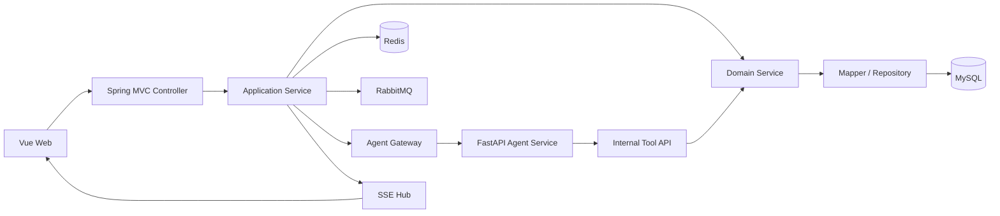
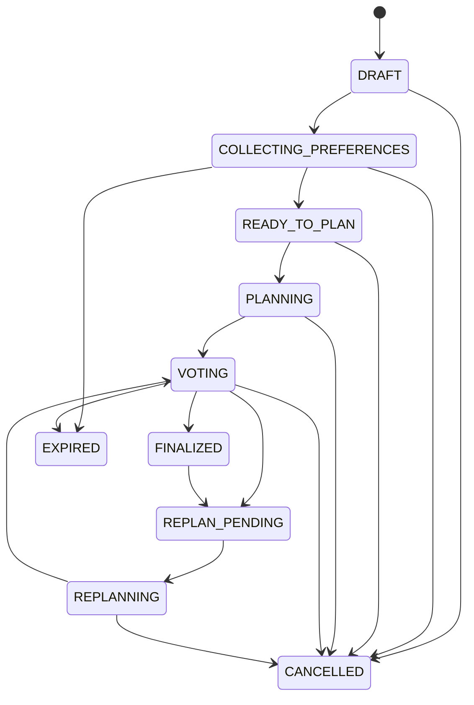
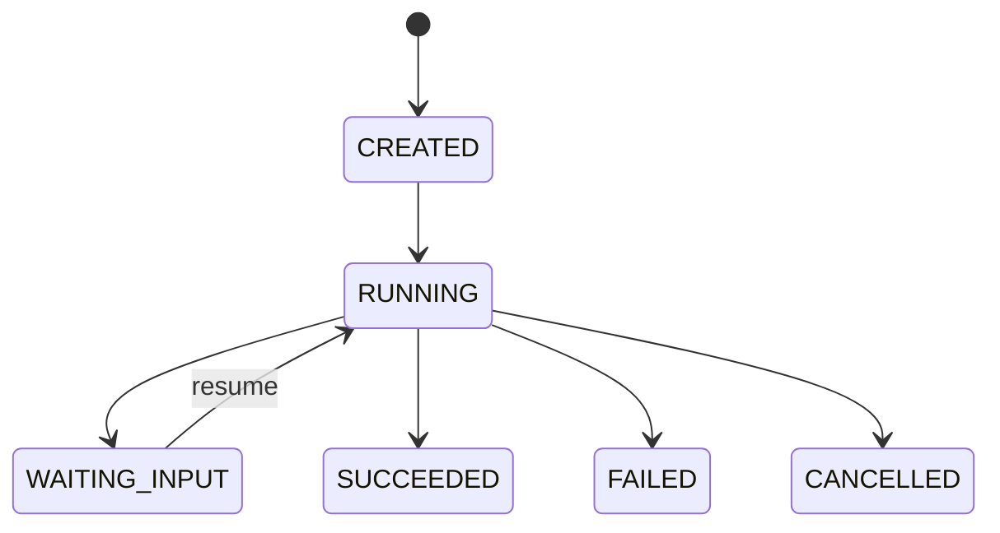
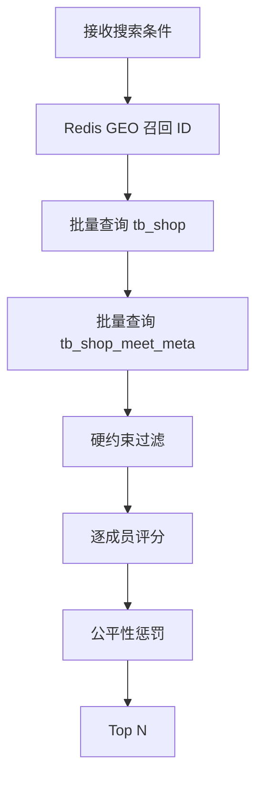
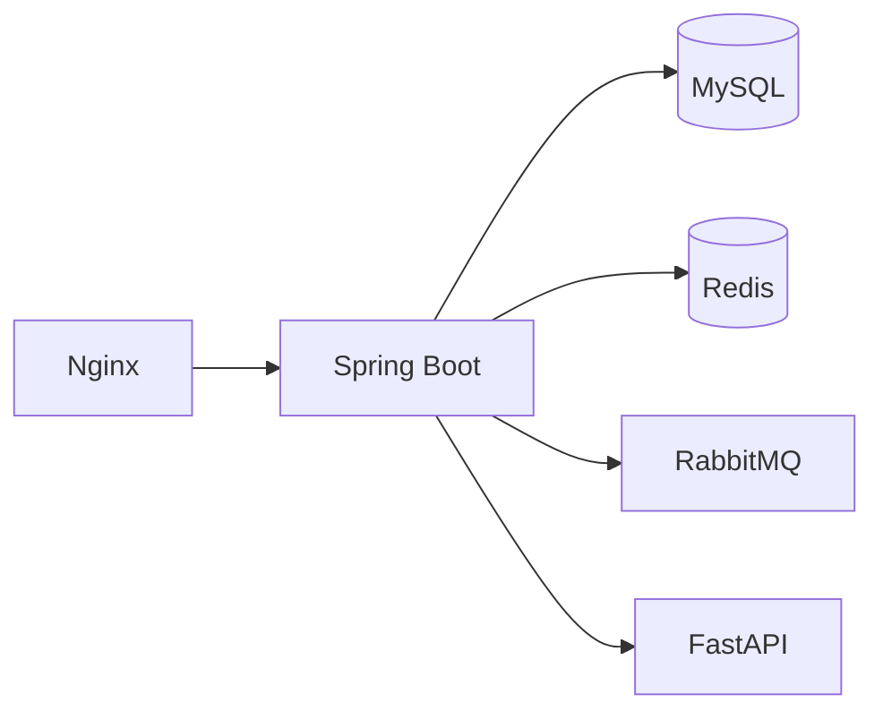

# MeetMate Java 后端技术架构设计

> 文档类型：Java 后端技术架构  
> 基础项目：`fffflllll/yun-dp`  
> 技术栈：Spring Boot 3、Java 17、MyBatis-Plus、MySQL、Redis、Redisson、RabbitMQ  
> 文档版本：v1.1

---

# 1. 文档目标

本文档定义 MeetMate Java 后端的职责边界、模块划分、领域模型、数据库结构、状态机、接口规范、并发控制、幂等设计、Agent Gateway、内部 Tool API、Redis、消息事件、SSE、权限、安全、测试与部署方案。

Java 后端是整个系统的业务主系统和唯一事实来源。

> **v1.1 修订（基于架构评审拍板）**：本版冻结四项关键决策，解决评审发现的 P0/P1 风险：
> - R1 澄清交互与恢复契约 —— Java 持有 HITL 业务状态，Python 负责发现问题并挂起 Graph（见 §33、ADR-002）；
> - R2 Java 独占确定性的过滤与评分，引入 Ranking Snapshot 防止评分漂移（见 §34、ADR-001）；
> - R3 截止时间由「命令侧 Deadline Guard + @Scheduled 扫描器」双保险驱动（见 §32、ADR-003）；
> - P1 投票规则冻结为多数制单选择 `SUPPORT` / `REJECT_ALL` / `ABSTAIN`（见 ADR-004）；
> - P1 FINALIZED 局部重规划引入 `REPLAN_PENDING` 中间态与 `LOCAL_REPLAN` Run 类型；
> - P1 `tb_shop_meet_meta` 增加数据来源治理字段（source / confidence / verified_at / verified_by / metadata_version）。

---

# 2. Java 后端职责

Java 负责：

- 用户登录与身份认证；
- 房间创建与管理；
- 成员邀请、加入和退出；
- 偏好草稿与确认；
- 房间状态机；
- 商铺召回；
- 硬约束过滤；
- 群体评分；
- 公平性计算；
- Agent Run 生命周期；
- 方案二次校验和落库；
- 投票；
- 最终方案；
- 幂等；
- 事务；
- 审计；
- SSE 推送；
- Redis 缓存与锁；
- RabbitMQ 业务事件。

Java 不负责：

- 自然语言语义理解；
- LLM Prompt；
- 自然语言偏好提取；
- 方案解释文案生成；
- 否决理由语义分类；
- LangGraph 节点编排。

> 评分归属（ADR-001）：所有数值评分（`distanceScore` / `budgetScore` / `categoryScore` / `qualityScore` / `memberScore` / `averageMemberScore` / `fairnessScore` / `groupScore` / `finalScore` / `rank`）一律由 Java 生成。Python 只能选择候选并生成解释文本，不得返回、修改或覆盖任何业务分数。

---

# 3. 总体架构



---

# 4. 改造策略

## 4.1 保留现有单体

不立即拆微服务。

原因：

- 当前业务规模较小；
- 用户、商铺、博客、优惠券已有能力可复用；
- MeetMate 首期更需要领域闭环；
- 微服务会增加部署、事务和调试成本。

## 4.2 新代码领域化分包

不继续把所有代码堆在：

```text
controller
service
service.impl
entity
```

推荐：

```text
com.hmdp
├── identity
├── shop
├── social
├── voucher
├── meet
│   ├── room
│   ├── member
│   ├── preference
│   ├── planning
│   ├── proposal
│   ├── vote
│   └── finalplan
├── agentgateway
├── common
└── infrastructure
```

---

# 5. 工程目录

```text
src/main/java/com/hmdp/
├── common/
│   ├── api/
│   ├── exception/
│   ├── idempotency/
│   ├── security/
│   ├── context/
│   ├── validation/
│   └── web/
├── meet/
│   ├── room/
│   │   ├── controller/
│   │   ├── application/
│   │   ├── domain/
│   │   ├── infrastructure/
│   │   └── dto/
│   ├── member/
│   ├── preference/
│   ├── planning/
│   ├── proposal/
│   ├── vote/
│   └── finalplan/
├── shop/
│   ├── application/
│   ├── domain/
│   └── infrastructure/
├── agentgateway/
│   ├── client/
│   ├── controller/
│   ├── service/
│   ├── dto/
│   ├── security/
│   └── audit/
└── infrastructure/
    ├── redis/
    ├── mq/
    ├── persistence/
    ├── observability/
    └── config/
```

---

# 6. 基线修复

MeetMate 开发前必须完成。

## 6.1 ThreadLocal 清理

请求完成后：

```java
@Override
public void afterCompletion(
        HttpServletRequest request,
        HttpServletResponse response,
        Object handler,
        Exception ex
) {
    UserHolder.removeUser();
}
```

## 6.2 删除 MQ 强制异常

删除消费者中的测试异常。

故障注入必须改为：

```text
test profile
配置开关
测试专用 Bean
```

## 6.3 修复商铺写接口权限

公开：

```text
GET /shop/**
GET /shop-type/**
```

受保护：

```text
POST /admin/shops
PUT /admin/shops/{id}
DELETE /admin/shops/{id}
```

## 6.4 统一缓存锁

优先使用 Redisson：

```java
RLock lock = redissonClient.getLock(lockKey);
```

不得固定值加锁后直接删除。

## 6.5 新接口统一响应

```java
public record ApiResponse<T>(
        String code,
        String message,
        T data,
        String requestId
) {}
```

---

# 7. 领域模型

# 7.1 Room

```text
Room
├── id
├── creatorId
├── title
├── sceneType
├── status
├── inviteCode
├── areaHint
├── centerX
├── centerY
├── searchRadiusMeter
├── maxMembers
├── minSubmittedMembers
├── preferenceDeadline
├── votingDeadline
├── votingRule
├── currentRound
├── version
└── timeOptions
```

## Room 聚合负责

- 房间状态；
- 房主权限；
- 当前轮次；
- 截止时间；
- 是否允许发起规划；
- 是否允许投票；
- 是否允许重规划。

---

# 7.2 Member

```text
Member
├── roomId
├── userId
├── role
├── status
├── inviteSource
├── preferenceStatus
└── joinTime
```

---

# 7.3 Preference

```text
Preference
├── roomId
├── userId
├── rawText
├── parsedJson
├── confirmedJson
├── status
├── parserVersion
└── version
```

---

# 7.4 AgentRun

```text
AgentRun
├── runId
├── roomId
├── roundNo
├── runType              # PLAN | REPLAN | LOCAL_REPLAN
├── status
├── currentNode
├── triggerUserId
├── inputSnapshot
├── stateSnapshot
├── modelName
├── promptVersion
├── errorCode
├── errorMessage
├── rankingSnapshotId   # 绑定本轮评分快照（R2，见 §34）
├── checkpointVersion   # LangGraph checkpoint 版本
├── checkpointDigest    # checkpoint 摘要，用于审计
├── runDeadline         # 运行超时截止（R3，见 §32）
├── heartbeatAt         # 心跳时间，超时判定 TIMED_OUT（R3）
├── startedAt
└── finishedAt
```

> v1.1 新增 `LOCAL_REPLAN` 运行类型：表示 FINALIZED 方案的局部替换任务。旧最终方案在新方案确认前仍然有效，新方案不能直接覆盖旧版本（见 §8、P1 局部重规划决策）。


---

# 7.5 Proposal

```text
Proposal
├── id
├── roomId
├── roundNo
├── proposalNo
├── shopId
├── suggestedTime
├── estimatedPerCapita
├── groupScore
├── fairnessScore
├── explanation
├── memberScoreJson
├── tradeoffJson
└── status
```

---

# 7.6 Vote

```text
Vote
├── roomId
├── roundNo
├── userId
├── proposalId          # SUPPORT 时指向所选方案
├── decision            # SUPPORT | REJECT_ALL | ABSTAIN
├── rejectionReasonType # 仅 REJECT_ALL 使用
├── rejectionReasonText # 仅 REJECT_ALL 使用
└── version
```

> **MVP 投票规则冻结（ADR-004）**：仅实现 `SUPPORT` / `REJECT_ALL` / `ABSTAIN` 三种决策，原排序投票字段 `ranking_json` 在 MVP 不使用（已从 `tb_meet_vote` 移除）。进入 `VOTING` 时冻结有效投票人快照（`JOINED` 且 `PREFERENCE_CONFIRMED` 且未退出）。通过条件 `supportCount >= floor(N/2)+1` 即立即通过；`REJECT_ALL >= majority` 或截止时无方案过半则本轮失败进入 `REPLAN_PENDING`。Java 评分只用于方案排序展示与 Agent 候选选择，不能替代成员共识，故删除原“平票由群体满意度优先”规则。


---

# 8. 房间状态机



状态转换必须集中在：

```text
RoomStateMachine
```

禁止 Controller 或 Mapper 直接修改状态。

> v1.1 新增 `REPLAN_PENDING` 中间态：
> - `VOTING → REPLAN_PENDING`：投票截止未过半、或 `REJECT_ALL` 达多数、或房主对 FINALIZED 发起局部替换时进入，等待房主确认是否真正重规划；
> - `REPLAN_PENDING → REPLANNING`：房主确认后创建 Agent Run 才进入实际重规划；
> - `FINALIZED → REPLAN_PENDING`：局部替换流程起点，旧最终方案保持有效直到新方案确认（`final_plan.version + 1`）。
> 区别：`REPLAN_PENDING` = 等待确认；`REPLANNING` = Agent 正在执行。

---

# 9. Agent Run 状态机



> v1.1 调整：原 `WAITING_USER_CONFIRMATION` / `WAITING_MORE_PREFERENCES` / `WAITING_VOTE_RESULT` 三个挂起态合并为单一 `WAITING_INPUT`——所有 Human-in-the-loop 中断（信息缺失澄清、放宽硬约束确认等）统一通过 `WAITING_INPUT` + 结构化 clarification 表达（见 §33、ADR-002）。`runType` 取值：`PLAN` / `REPLAN` / `LOCAL_REPLAN`（局部替换，不删除旧最终方案）。

同一房间同一时刻只能有一个：

```text
PLAN
REPLAN
```

处于活跃状态。

---

# 10. 数据库设计

## 10.1 tb_meet_room

```sql
CREATE TABLE tb_meet_room (
    id BIGINT PRIMARY KEY,
    creator_id BIGINT NOT NULL,
    title VARCHAR(100) NOT NULL,
    scene_type VARCHAR(32) NOT NULL,
    invite_code VARCHAR(8) NOT NULL,
    status VARCHAR(32) NOT NULL,
    area_hint VARCHAR(128),
    center_x DECIMAL(10, 6),
    center_y DECIMAL(10, 6),
    search_radius_meter INT NOT NULL,
    max_members INT NOT NULL,
    min_submitted_members INT NOT NULL,
    preference_deadline DATETIME,
    voting_deadline DATETIME,
    voting_rule VARCHAR(32) NOT NULL,
    current_round INT NOT NULL DEFAULT 0,
    time_options_json JSON NOT NULL,
    version INT NOT NULL DEFAULT 0,
    create_time DATETIME NOT NULL,
    update_time DATETIME NOT NULL,
    UNIQUE KEY uk_invite_code(invite_code),
    KEY idx_creator_status(creator_id, status),
    KEY idx_preference_deadline(preference_deadline)
);
```

## 10.2 tb_meet_member

```sql
CREATE TABLE tb_meet_member (
    id BIGINT PRIMARY KEY,
    room_id BIGINT NOT NULL,
    user_id BIGINT NOT NULL,
    role VARCHAR(16) NOT NULL,
    status VARCHAR(32) NOT NULL,
    invite_source VARCHAR(16) NOT NULL,
    preference_status VARCHAR(32) NOT NULL,
    join_time DATETIME,
    create_time DATETIME NOT NULL,
    update_time DATETIME NOT NULL,
    UNIQUE KEY uk_room_user(room_id, user_id),
    KEY idx_user_status(user_id, status)
);
```

## 10.3 tb_meet_preference

```sql
CREATE TABLE tb_meet_preference (
    id BIGINT PRIMARY KEY,
    room_id BIGINT NOT NULL,
    user_id BIGINT NOT NULL,
    raw_text TEXT,
    parsed_json JSON,
    confirmed_json JSON,
    status VARCHAR(16) NOT NULL,
    parser_version VARCHAR(32),
    version INT NOT NULL DEFAULT 0,
    create_time DATETIME NOT NULL,
    update_time DATETIME NOT NULL,
    UNIQUE KEY uk_room_user_preference(room_id, user_id)
);
```

## 10.4 tb_meet_agent_run

```sql
CREATE TABLE tb_meet_agent_run (
    id VARCHAR(64) PRIMARY KEY,
    room_id BIGINT NOT NULL,
    round_no INT NOT NULL,
    run_type VARCHAR(32) NOT NULL,
    status VARCHAR(32) NOT NULL,
    current_node VARCHAR(64),
    trigger_user_id BIGINT NOT NULL,
    input_snapshot JSON,
    state_snapshot JSON,
    model_name VARCHAR(64),
    prompt_version VARCHAR(32),
    error_code VARCHAR(64),
    error_message VARCHAR(512),
    ranking_snapshot_id VARCHAR(64),
    checkpoint_version VARCHAR(32),
    checkpoint_digest VARCHAR(64),
    run_deadline DATETIME,
    heartbeat_at DATETIME,
    started_at DATETIME,
    finished_at DATETIME,
    create_time DATETIME NOT NULL,
    KEY idx_room_status(room_id, status),
    KEY idx_room_round(room_id, round_no)
);
```

## 10.5 tb_meet_proposal

```sql
CREATE TABLE tb_meet_proposal (
    id BIGINT PRIMARY KEY,
    room_id BIGINT NOT NULL,
    round_no INT NOT NULL,
    proposal_no INT NOT NULL,
    shop_id BIGINT NOT NULL,
    suggested_time DATETIME,
    estimated_per_capita DECIMAL(10, 2),
    group_score DECIMAL(10, 4),
    fairness_score DECIMAL(10, 4),
    explanation TEXT,
    member_score_json JSON,
    tradeoff_json JSON,
    status VARCHAR(16) NOT NULL,
    create_time DATETIME NOT NULL,
    UNIQUE KEY uk_room_round_no(room_id, round_no, proposal_no)
);
```

## 10.6 tb_meet_vote

```sql
CREATE TABLE tb_meet_vote (
    id BIGINT PRIMARY KEY,
    room_id BIGINT NOT NULL,
    round_no INT NOT NULL,
    user_id BIGINT NOT NULL,
    proposal_id BIGINT,
    decision VARCHAR(16) NOT NULL,
    rejection_reason_type VARCHAR(32),
    rejection_reason_text VARCHAR(512),
    version INT NOT NULL DEFAULT 0,
    create_time DATETIME NOT NULL,
    update_time DATETIME NOT NULL,
    UNIQUE KEY uk_room_round_user(room_id, round_no, user_id)
);
```

## 10.7 tb_meet_final_plan

```sql
CREATE TABLE tb_meet_final_plan (
    id BIGINT PRIMARY KEY,
    room_id BIGINT NOT NULL,
    proposal_id BIGINT NOT NULL,
    version INT NOT NULL,
    plan_json JSON NOT NULL,
    backup_plan_json JSON,
    finalized_by BIGINT NOT NULL,
    create_time DATETIME NOT NULL,
    update_time DATETIME NOT NULL,
    UNIQUE KEY uk_room_version(room_id, version)
);
```

## 10.8 tb_shop_meet_meta

```sql
CREATE TABLE tb_shop_meet_meta (
    shop_id BIGINT PRIMARY KEY,
    tags_json JSON,
    spicy_level INT,
    metro_distance_meter INT,
    suitable_scenes_json JSON,
    estimated_wait_minutes INT,
    business_hours_json JSON,
    allergen_tags_json JSON,
    source VARCHAR(32) NOT NULL,
    confidence DECIMAL(5,4),
    verified_at DATETIME,
    verified_by BIGINT,
    metadata_version INT NOT NULL DEFAULT 1,
    update_time DATETIME NOT NULL,
    KEY idx_source(source)
);

## 10.9 tb_meet_clarification

> 支撑 R1（澄清交互与恢复契约，见 §33、ADR-002）。Java 持有 Human-in-the-loop 业务状态，Python 发现信息缺失时请求 Java 创建 clarification 并挂起 Graph。

```sql
CREATE TABLE tb_meet_clarification (
    id VARCHAR(64) PRIMARY KEY,
    run_id VARCHAR(64) NOT NULL,
    room_id BIGINT NOT NULL,
    round_no INT NOT NULL,

    target_type VARCHAR(16) NOT NULL,
    target_user_id BIGINT NULL,

    question_code VARCHAR(64) NOT NULL,
    question_title VARCHAR(128) NOT NULL,
    question_text VARCHAR(1000) NOT NULL,

    answer_type VARCHAR(32) NOT NULL,
    options_json JSON NULL,
    validation_json JSON NULL,
    default_answer_json JSON NULL,

    required_flag TINYINT NOT NULL DEFAULT 1,
    resume_policy VARCHAR(32) NOT NULL,
    expire_policy VARCHAR(32) NOT NULL,

    status VARCHAR(32) NOT NULL,
    answer_json JSON NULL,
    answered_by BIGINT NULL,

    expires_at DATETIME NULL,
    answered_at DATETIME NULL,
    version INT NOT NULL DEFAULT 0,
    create_time DATETIME NOT NULL,
    update_time DATETIME NOT NULL,

    KEY idx_run_status(run_id, status),
    KEY idx_room_target(room_id, target_user_id, status)
);
```

枚举：

- `target_type`：`USER` / `OWNER` / `ALL_MEMBERS` / `ANY_MEMBER`
- `answer_type`：`SINGLE_CHOICE` / `MULTI_CHOICE` / `TEXT` / `NUMBER` / `TIME` / `TIME_RANGE` / `BOOLEAN` / `LOCATION`
- `status`：`PENDING` / `ANSWERED` / `EXPIRED` / `CANCELLED` / `CONSUMED`
- `resume_policy`：`IMMEDIATE` / `ALL_REQUIRED_ANSWERED` / `OWNER_CONFIRMATION`
- `expire_policy`：`FAIL_RUN` / `USE_DEFAULT` / `SKIP_TARGET_MEMBER` / `WAIT_OWNER_DECISION`

## 10.10 tb_meet_ranking_snapshot

> 支撑 R2（Java 独占评分，见 §34、ADR-001）。方案必须绑定本次评分快照，防止 Python 生成解释期间店铺或偏好更新造成评分漂移。

```sql
CREATE TABLE tb_meet_ranking_snapshot (
    id VARCHAR(64) PRIMARY KEY,
    run_id VARCHAR(64) NOT NULL,
    room_id BIGINT NOT NULL,
    round_no INT NOT NULL,
    criteria_digest VARCHAR(64) NOT NULL,
    preference_version_digest VARCHAR(64) NOT NULL,
    candidate_json JSON NOT NULL,
    algorithm_version VARCHAR(32) NOT NULL,
    create_time DATETIME NOT NULL,
    KEY idx_run(run_id),
    KEY idx_room_round(room_id, round_no)
);
```

---
```

---

# 11. API 规范

统一前缀：

```text
/api
```

统一响应：

```json
{
  "code": "OK",
  "message": "success",
  "data": {},
  "requestId": "01J..."
}
```

## 11.1 房间 API

```text
POST   /api/meet/rooms
GET    /api/meet/rooms/{roomId}
PUT    /api/meet/rooms/{roomId}
POST   /api/meet/rooms/{roomId}/start-collection
POST   /api/meet/rooms/{roomId}/cancel
GET    /api/meet/rooms/recent
```

## 11.2 成员 API

```text
POST   /api/meet/rooms/{roomId}/members/invite
POST   /api/meet/rooms/join-by-code
GET    /api/meet/rooms/{roomId}/members
DELETE /api/meet/rooms/{roomId}/members/{userId}
POST   /api/meet/rooms/{roomId}/leave
```

## 11.3 偏好 API

```text
POST   /api/meet/rooms/{roomId}/preferences/parse
GET    /api/meet/rooms/{roomId}/preferences/me
PUT    /api/meet/rooms/{roomId}/preferences/me
POST   /api/meet/rooms/{roomId}/preferences/me/confirm
```

## 11.4 规划 API

```text
POST   /api/meet/rooms/{roomId}/planning-runs
GET    /api/meet/rooms/{roomId}/planning-runs/current
GET    /api/meet/agent-runs/{runId}
GET    /api/meet/agent-runs/{runId}/stream
POST   /api/meet/rooms/{roomId}/replan
POST   /api/meet/rooms/{roomId}/replan/local
GET    /api/meet/rooms/{roomId}/clarifications
GET    /api/meet/agent-runs/{runId}/clarifications
POST   /api/meet/clarifications/{clarificationId}/answers
```

> `replan/local` 创建 `LOCAL_REPLAN` 运行（局部替换，FINALIZED 方案保持不变直到新方案确认）。澄清记录**不由前端创建**——Python 发现信息缺失时通过内部接口请求 Java 创建 `tb_meet_clarification`（见 §33），前端仅查询与作答。
```

## 11.5 方案与投票

```text
GET    /api/meet/rooms/{roomId}/proposals
POST   /api/meet/rooms/{roomId}/votes
PUT    /api/meet/rooms/{roomId}/votes/me
GET    /api/meet/rooms/{roomId}/vote-result
POST   /api/meet/rooms/{roomId}/finalize
GET    /api/meet/rooms/{roomId}/final-plan
```

---

# 12. 权限设计

## 12.1 身份层

继续复用登录 Token。

请求进入后形成：

```java
public record CurrentUser(
        Long userId,
        String nickname
) {}
```

不允许异步线程直接读取 ThreadLocal。

异步任务必须显式传递：

```text
userId
roomId
runId
```

## 12.2 房间权限

```text
ROOM_MEMBER
ROOM_OWNER
INTERNAL_AGENT
ADMIN
```

校验顺序：

```text
是否登录
→ 房间是否存在
→ 是否房间成员
→ 是否满足角色
→ 房间状态是否允许
→ 资源是否属于当前轮次
```

---

# 13. 应用服务设计

## 13.1 RoomApplicationService

职责：

- 创建房间；
- 修改房间；
- 状态转换；
- 取消；
- 查询详情；
- 最近房间。

## 13.2 MemberApplicationService

职责：

- 邀请；
- 加入；
- 移除；
- 退出；
- 成员状态更新。

## 13.3 PreferenceApplicationService

职责：

- 保存原始文本；
- 调用偏好解析 Agent；
- 保存解析草稿；
- 用户确认；
- 更新成员偏好状态；
- 判断房间是否 READY_TO_PLAN。

## 13.4 PlanningApplicationService

职责：

- 校验房间；
- 获取分布式锁；
- 创建 Agent Run；
- 更新房间为 PLANNING；
- 调用 Python；
- 接收 Agent 回调；
- 校验并保存方案；
- 更新为 VOTING。

## 13.5 VoteApplicationService

职责：

- 提交投票；
- 修改投票；
- 统计；
- 判断通过；
- 触发最终方案；
- 触发重规划。

---

# 14. 商铺候选召回

现有 GEO 查询需要重构为独立服务：

```java
public interface ShopCandidateSearchService {
    List<ShopCandidate> search(ShopSearchCriteria criteria);
}
```

请求模型：

```java
public record ShopSearchCriteria(
        List<Long> categoryIds,
        Double centerX,
        Double centerY,
        Integer radiusMeters,
        Long maxPrice,
        Integer minScore,
        LocalDateTime visitTime,
        Set<Long> excludedShopIds,
        Integer limit
) {}
```

执行流程：



---

# 15. 硬约束过滤

Java 必须执行：

- 预算；
- 距离；
- 营业时间；
- 明确饮食禁忌；
- 过敏标签；
- 已否决店铺；
- 共同时间；
- 房间区域；
- 当前轮次排除项。

接口：

```java
public interface HardConstraintFilter {
    FilterResult filter(
        ShopCandidate candidate,
        GroupConstraintContext context
    );
}
```

返回：

```text
accepted
violations
evidence
```

---

# 16. 群体评分

建议：

```text
memberScore =
    0.30 × distanceScore
  + 0.25 × categoryScore
  + 0.20 × budgetScore
  + 0.15 × qualityScore
  + 0.10 × sceneScore
```

群体分：

```text
averageScore = 所有成员分数平均值
minimumScore = 最低成员分
variancePenalty = 成员分数方差惩罚

finalScore =
    averageScore
  - fairnessWeight × variancePenalty
  - lowMemberPenalty
```

Java 返回：

```json
{
  "shopId": 1,
  "groupScore": 86.2,
  "fairnessScore": 91.0,
  "memberScores": [
    {
      "userId": 10,
      "score": 82,
      "details": {
        "distance": 80,
        "budget": 100,
        "category": 70
      }
    }
  ]
}
```

---

# 17. Agent Gateway

Java 调用 Python：

```text
POST /internal/agent/runs
POST /internal/agent/preferences/parse
POST /internal/agent/runs/{runId}/resume
POST /internal/agent/runs/{runId}/cancel
```

Java Client：

```java
public interface AgentClient {
    PreferenceParseResponse parsePreference(
        PreferenceParseRequest request
    );

    AgentRunAccepted startPlanning(
        PlanningStartRequest request
    );

    void resumeRun(
        String runId,
        AgentResumeRequest request
    );

    void cancelRun(String runId);
}
```

要求：

- 连接超时；
- 读取超时；
- 重试只针对幂等请求；
- 熔断；
- 服务认证；
- requestId；
- runId；
- 日志脱敏。

---

# 18. Internal Tool API

仅 Python 调用。

```text
GET  /internal/agent-tools/rooms/{roomId}/context
POST /internal/agent-tools/shops/search
POST /internal/agent-tools/shops/rank
GET  /internal/agent-tools/shops/{shopId}
GET  /internal/agent-tools/shops/{shopId}/vouchers
POST /internal/agent-tools/runs/{runId}/progress
POST /internal/agent-tools/runs/{runId}/proposals
```

## 18.1 服务认证

至少实现：

```text
X-Service-Name
X-Service-Timestamp
X-Service-Nonce
X-Service-Signature
```

签名基于：

```text
method
path
timestamp
nonce
bodyDigest
sharedSecret
```

后续可升级为：

- mTLS；
- Service Mesh；
- 内网网关。

## 18.2 范围校验

Python 不能任意指定用户。

Java 必须校验：

- runId 是否存在；
- runId 是否属于 roomId；
- run 是否 RUNNING；
- tool 是否允许；
- shopId 是否属于当前候选范围；
- proposal 是否违反硬约束。

---

# 19. Agent 提交方案的二次校验

Python 返回方案后，Java 必须重新执行：

1. shopId 是否存在；
2. shopId 是否在本轮候选集合；
3. 是否违反硬约束；
4. suggestedTime 是否在共同时间；
5. 价格是否有效；
6. 是否重复店铺；
7. proposalNo 是否唯一；
8. 方案数量是否合理；
9. 解释中引用字段是否存在。

只有通过后才能落库。

---

# 20. 幂等设计

## 20.1 创建房间

请求头：

```text
Idempotency-Key
```

Redis：

```text
meet:idempotency:{userId}:{key}
```

## 20.2 创建 Agent Run

唯一条件：

```text
roomId + activeRunType
```

使用：

- Redisson 锁；
- 数据库状态检查；
- 唯一约束或业务校验。

## 20.3 保存方案

唯一键：

```text
roomId + roundNo + proposalNo
```

## 20.4 投票

唯一键：

```text
roomId + roundNo + userId
```

使用 Upsert 或乐观锁更新。

---

# 21. 事务设计

必须在单事务内完成：

## 21.1 创建房间

- 写 room；
- 写 owner member；
- 写 inviteCode 映射的最终事实；
- 提交后写 Redis。

## 21.2 开始规划

- 校验状态；
- 创建 Agent Run；
- 房间转 PLANNING；
- 提交事务；
- 事务提交后调用 Python。

## 21.3 保存方案

- 校验方案；
- 批量写 proposal；
- 更新 run 为 SUCCEEDED；
- 更新 room 为 VOTING；
- 写事件。

## 21.4 最终方案

- 统计投票；
- 写 final plan；
- 更新 proposal；
- 更新 room 为 FINALIZED。

---

# 22. Redis 设计

```text
meet:invite:{inviteCode}
meet:room:{roomId}:summary
meet:room:{roomId}:members
meet:room:{roomId}:agent:lock
meet:room:{roomId}:vote:{round}
meet:user:{userId}:recent-rooms
meet:agent:run:{runId}:progress
meet:idempotency:{userId}:{key}
meet:sse:run:{runId}
```

原则：

- MySQL 是最终事实；
- Redis 可重建；
- 锁使用 Redisson；
- Key 有 TTL；
- 状态更新后主动失效缓存；
- 不把最终投票只存在 Redis。

---

# 23. RabbitMQ 设计

MVP 推荐保留少量事件：

```text
meet.preference.confirmed
meet.agent.run.progress
meet.proposal.generated
meet.vote.completed
meet.plan.finalized
```

不建议第一版把每个动作都事件化。

事件统一结构：

```json
{
  "eventId": "01J...",
  "eventType": "meet.vote.completed",
  "aggregateType": "MEET_ROOM",
  "aggregateId": "10001",
  "occurredAt": "2026-07-11T20:00:00+08:00",
  "payload": {}
}
```

消费者必须幂等。

---

# 24. SSE 设计

Java 对浏览器提供：

```text
GET /api/meet/agent-runs/{runId}/stream
```

内部维护：

```text
runId → SseEmitter 集合
```

生产环境建议：

- 进度写 Redis Stream；
- Java 实例订阅并推送；
- 支持多实例；
- 使用 Last-Event-ID；
- 超时后重新连接。

事件来源：

```text
Python → Java progress API
Java → Redis Stream / Event Bus
Java → SSE Browser
```

---

# 25. 错误码

```text
AUTH_REQUIRED
PERMISSION_DENIED
ROOM_NOT_FOUND
ROOM_STATUS_CONFLICT
ROOM_MEMBER_LIMIT_REACHED
PREFERENCE_NOT_CONFIRMED
NOT_ENOUGH_PREFERENCES
AGENT_RUN_ALREADY_ACTIVE
AGENT_SERVICE_UNAVAILABLE
AGENT_OUTPUT_INVALID
NO_VALID_CANDIDATE
VOTE_ALREADY_CLOSED
IDEMPOTENCY_CONFLICT
INTERNAL_ERROR
```

HTTP 状态应与业务一致。

---

# 26. 可观测性

日志字段：

```text
requestId
userId
roomId
runId
roundNo
eventId
toolName
durationMs
errorCode
```

指标：

- API P95；
- Agent Run 成功率；
- 无候选率；
- 平均方案生成时间；
- 工具调用耗时；
- SSE 在线连接数；
- 投票完成率；
- 重规划次数；
- 硬约束拦截次数。

---

# 27. 安全

- 用户只能访问自己的房间；
- 内部 Tool API 不对公网暴露；
- Python 不直接访问数据库；
- 不向 LLM 发送手机号；
- 原始偏好可删除；
- 日志不保存敏感全文；
- Prompt Injection 内容视为普通数据；
- Tool 参数必须 Schema 校验；
- 禁止执行 LLM 生成的 SQL；
- 过敏信息属于高优先级硬约束；
- 最终页面提示到店再次确认。

---

# 28. 测试策略

## 28.1 单元测试

- 状态机；
- 权限；
- 硬约束；
- 评分；
- 公平性；
- 投票规则；
- 幂等。

## 28.2 集成测试

使用：

- Testcontainers MySQL；
- Testcontainers Redis；
- Testcontainers RabbitMQ；
- Mock Agent Service。

## 28.3 契约测试

Java 与 Python：

- OpenAPI；
- JSON Schema；
- 错误码；
- 超时；
- 重试；
- 非法输出。

## 28.4 并发测试

覆盖：

- 连续点击生成方案；
- 同一用户重复投票；
- 多成员同时确认偏好；
- 房主取消与 Agent 完成竞态；
- Redis 锁超时；
- MQ 重复投递。

---

# 29. 部署



首期 Docker Compose：

```text
nginx
web
java-app
agent-service
mysql
redis
rabbitmq
```

---

# 30. 首批开发任务

1. 修复 ThreadLocal；
2. 删除 MQ 强制异常；
3. 修复商铺写权限；
4. 新增统一响应与异常；
5. 新增 `meet` 领域；
6. 建表；
7. 实现房间和成员；
8. 实现手动结构化偏好；
9. 重构 GEO 搜索；
10. 实现硬约束过滤；
11. 实现群体评分；
12. 实现方案与投票；
13. 实现 Agent Run；
14. 实现 Agent Gateway；
15. 实现 Tool API；
16. 实现 SSE；
17. 实现重规划；
18. 增加测试。
19. 实现澄清表 `tb_meet_clarification` 与 clarification API（R1，§33）；
20. 实现 Ranking Snapshot 落库与防漂移（R2，§34）；
21. 实现 Deadline Guard 与定时扫描器、Agent 运行超时（R3，§32）；
22. 实现 `REPLAN_PENDING` 与 `LOCAL_REPLAN` 局部替换；
23. 实现多数制投票统计（ADR-004）；
24. 配置 Python Checkpoint Redis 隔离（namespace + TTL）；
25. 落地 ADR-001~004 与 Java/Python 契约测试。

---

# 31. Java 后端验收标准

- Java 是唯一业务事实来源；
- Python 无数据库连接；
- 所有状态转换集中管理；
- 同房间只有一个活跃规划任务；
- 硬约束由 Java 二次校验；
- 投票重复提交不会生成重复数据；
- Agent 失败不影响普通接口；
- 服务重启后任务状态可恢复；
- SSE 断线可重连；
- 所有内部 Tool 调用有审计；
- 关键并发场景有自动化测试；
- 澄清链路：Python 挂起后用户作答只经 Java API，前端不直接调用 Python resume（ADR-002）；
- 所有数值评分由 Java 生成，Python 提交方案不含任何 score 字段（ADR-001）；
- 截止时间由「命令侧 Guard + 定时扫描」双保险驱动，房间不会永久停留 EXPIRED/PLANNING（ADR-003）；
- 投票为多数制单选择，平票不兜底、不强行替用户选结果（ADR-004）；
- FINALIZED 局部重规划经 REPLAN_PENDING 中间态，旧方案确认前保持有效；
- `tb_shop_meet_meta` 硬约束字段缺失时按 UNKNOWN 策略处理，`LLM_INFERRED` 不参与硬约束。

---

# 32. 截止时间驱动（R3，对应 ADR-003）

> 仅用定时器不够（扫描可能延迟），仅用接口校验不够（无人访问时状态不更新）。两者必须同时存在。

## 32.1 命令侧 Deadline Guard

所有写操作执行前检查，即使调度器晚执行也不允许过期请求成功：

- `submitPreference` → `ensurePreferenceOpen(room)`
- `startPlanning` → `ensurePreferenceOpen(room)`
- `submitVote` / `modifyVote` → `ensureVotingOpen(room)`
- `answerClarification` → `ensureClarificationOpen(clarification)`
- `inviteMember` → `ensurePreferenceOpen(room)`

## 32.2 定时扫描器

```java
@Scheduled(fixedDelayString = "${meet.deadline.scan-interval:60000}")
public void processExpiredDeadlines() { ... }
```

- 多实例部署使用 Redisson 锁 `lock:meet:deadline-scheduler`；
- 分页批次扫描（每批 100 条），避免一次加载全部房间；
- 扫描延迟期间命令侧 Guard 仍保证过期请求不成功。

## 32.3 偏好截止规则

- 已达最少提交人数：`COLLECTING_PREFERENCES → READY_TO_PLAN`，未提交成员标记 `PREFERENCE_MISSED`，不进入有效投票人快照；
- 未达最少提交人数：`COLLECTING_PREFERENCES → EXPIRED`，**不得**用未提交成员的默认偏好偷偷完成规划。

## 32.4 投票截止规则

`votingDeadline` 到达时重新执行一次权威投票统计：

- 满足通过条件 → `FINALIZED`；
- 不满足 → `REPLAN_PENDING`（不直接进 `REPLANNING`）。

## 32.5 clarification 截止规则

由每条 clarification 的 `expirePolicy` 决定：

- `FAIL_RUN`：搜索中心缺失等 P0 缺失；
- `USE_DEFAULT`：非关键环境偏好，使用 `default_answer_json`；
- `SKIP_TARGET_MEMBER`：某普通成员非关键补充；
- `WAIT_OWNER_DECISION`：放宽硬约束等需房主决策。

## 32.6 Agent 运行超时

`tb_meet_agent_run` 增加 `runDeadline` 与 `heartbeatAt`。定时扫描：

- `RUNNING` 且 `heartbeatAt` 超过阈值 → `FAILED` / `TIMED_OUT`；
- 否则 Python 进程崩溃后房间可能永久停留 `PLANNING`。

## 32.7 为什么不首期使用延时 MQ

RabbitMQ 延迟插件需额外部署、消息可能重复、截止时间修改需取消旧消息、消费者故障仍需补偿扫描。MVP 采用「数据库 Deadline + 命令侧校验 + 定时扫描」，后续再用延时消息提高及时性。

---

# 33. 澄清交互与恢复契约（R1，对应 ADR-002）

> 决策：**Java 持有 Human-in-the-loop 业务状态，Python 负责发现问题并挂起 Graph。** 前端绝不能直接调用 Python 的 `resume`。

## 33.1 端到端链路

```text
Python 发现信息不足
   ↓
Python 请求 Java 创建 clarification（内部接口）
   ↓
Java 写入 tb_meet_clarification，更新 AgentRun = WAITING_INPUT
   ↓
Java 通过 SSE 通知前端
   ↓
用户通过 Java API 提交答案
   ↓
Java 保存并校验答案
   ↓
Java 事务提交后调用 Python resume
   ↓
Python 使用 LangGraph Command(resume=...) 恢复
```

## 33.2 WAITING_INPUT SSE 事件（结构化问题）

不应只传“请补充信息”，而传可渲染的结构化问题：

```json
{
  "eventId": "evt_01J...",
  "type": "WAITING_INPUT",
  "runId": "run_01J...",
  "roomId": 10001,
  "stage": "CLARIFICATION",
  "message": "还需要确认聚会地点范围",
  "clarification": {
    "clarificationId": "clar_01J...",
    "targetType": "OWNER",
    "targetUserId": 20001,
    "questionCode": "SEARCH_CENTER_MISSING",
    "title": "请选择搜索中心",
    "question": "这次聚会准备在哪个区域附近寻找餐厅？",
    "answerType": "LOCATION",
    "options": [
      { "value": "room_area_hint", "label": "使用房间填写的区域" },
      { "value": "custom", "label": "重新选择位置" }
    ],
    "validation": { "required": true },
    "expiresAt": "2026-07-12T18:00:00+08:00",
    "resumePolicy": "IMMEDIATE"
  },
  "timestamp": "2026-07-11T22:00:00+08:00"
}
```

前端根据 `answerType` 选择控件，不解析自然语言问题。

## 33.3 面向前端的 API

```text
GET  /api/meet/rooms/{roomId}/clarifications
GET  /api/meet/agent-runs/{runId}/clarifications
POST /api/meet/clarifications/{clarificationId}/answers
```

提交答案：

```json
{
  "answer": { "longitude": 120.149993, "latitude": 30.334229, "label": "拱墅区远洋乐堤港" },
  "version": 0
}
```

Java 负责校验：用户是否为目标回答人、clarification 是否仍为 `PENDING`、是否过期、答案类型是否合法、是否重复回答、是否已满足恢复条件。

## 33.4 Java 调 Python 恢复接口

```text
POST /internal/agent/runs/{runId}/resume
```

```json
{
  "requestId": "req_01J...",
  "runId": "run_01J...",
  "roomId": 10001,
  "clarificationId": "clar_01J...",
  "answer": { "longitude": 120.149993, "latitude": 30.334229, "label": "拱墅区远洋乐堤港" },
  "answeredBy": 20001,
  "answeredAt": "2026-07-11T22:05:00+08:00"
}
```

Python 恢复时只接收 Java 已校验后的标准化数据，不信任前端原始答案。

## 33.5 幂等与竞态

- 用户双击提交、多人同时回答、回答时任务已取消、过期与回答同时发生、Java 调 Python resume 超时、Python 已恢复但 Java 未收到响应；
- 以 `clarificationId + answerVersion` 作为恢复幂等键；
- Python 记录已消费的 `clarificationId`，重复 resume 返回原状态，不重复执行节点。

---

# 34. 评分归属与 Ranking Snapshot（R2，对应 ADR-001）

> 决策：**Java 独占所有数值评分，Python 不得产生、修改或覆盖任何业务分数。**

## 34.1 权威评分清单（均由 Java 生成）

`distanceScore` / `budgetScore` / `categoryScore` / `qualityScore` / `memberScore` / `averageMemberScore` / `fairnessScore` / `groupScore` / `finalScore` / `rank`。

## 34.2 Python 输出 Schema（无 score）

```python
class MemberMatchExplanation(BaseModel):
    user_id: int
    matched_preferences: list[str]
    tradeoffs: list[str]
    explanation: str

class ProposalSuggestion(BaseModel):
    proposal_no: int
    shop_id: int
    positioning: str
    explanation: str
    member_matches: list[MemberMatchExplanation]
    cited_fact_keys: list[str]
```

Python 只返回：选择哪个候选店铺、方案定位、自然语言解释、哪些偏好被满足、哪些软偏好作了让步、解释引用了哪些 Java 字段。

## 34.3 Java 给 Python 的候选数据（含评分，仅供选择与解释）

```json
{
  "rankingSnapshotId": "rank_01J...",
  "rankingVersion": 1,
  "candidates": [
    {
      "shopId": 10, "rank": 1, "groupScore": 86.2, "fairnessScore": 91.0,
      "memberScores": [
        { "userId": 100, "score": 82.0,
          "details": { "distanceScore": 80.0, "budgetScore": 100.0, "categoryScore": 70.0 } }
      ],
      "facts": { "avgPrice": 78, "distanceMeters": 1800, "score": 47, "openAtSuggestedTime": true }
    }
  ]
}
```

## 34.4 Java 落库逻辑

Java 根据 `rankingSnapshotId + shopId` 重新取得权威评分后写入 `group_score` / `fairness_score` / `member_score_json` / `estimated_per_capita` / `suggested_time`。Python 提交内容即便夹带分数字段，应当：直接拒绝未知字段（严格 JSON Schema），或完全忽略。

## 34.5 Ranking Snapshot 防漂移

Python 生成解释期间店铺或偏好更新会造成评分漂移。方案必须绑定 `tb_meet_ranking_snapshot`（见 §10.10），不使用实时重新变化的分数。

---

# 35. 架构决策记录（ADR-001 ~ ADR-004）

## ADR-001：Java 独占确定性的过滤与评分

- **状态**：Accepted
- **上下文**：原 PRD 允许 Python 的 `ProposalSuggestion` 填 `score`，与 Java §16 权威评分方冲突，两份分数可能打架。
- **决策**：LLM 只能选择和解释 Java 已评分候选；任何数值评分、排名、通过判定均由 Java 独占。Python 输出删除所有 score 字段。
- **后果**：评分逻辑可单测、可复现；代价是 Python 解释必须引用 Java 字段（`cited_fact_keys`），且需 Ranking Snapshot 防漂移。

## ADR-002：Java 是 HITL 持久化协调者，LangGraph 是可恢复执行器

- **状态**：Accepted
- **上下文**：澄清交互端到端契约未定义，三份文档各写各的假设会导致前端/Java/Python 返工。
- **决策**：Java 持有澄清业务状态与恢复触发；Python 只负责发现问题、请求创建 clarification、用 `Command(resume=...)` 恢复。前端禁止直连 Python resume。
- **后果**：AI 服务不反客为主；代价是 Java 需维护 clarification 生命周期与幂等恢复键。

## ADR-003：截止时间由命令侧 Guard + 定时扫描双保险驱动

- **状态**：Accepted
- **上下文**：`preferenceDeadline` / `votingDeadline` 超时转 `EXPIRED` / `REPLAN_PENDING` 没有调度器，房间永远不会过期。
- **决策**：MVP 使用命令侧 Deadline Guard（写前校验）+ `@Scheduled` 扫描（Redisson 锁、分页批次）+ Agent 运行超时。暂不以延时 MQ 为唯一方案。
- **后果**：状态必然推进；代价是多实例需锁、扫描有秒级延迟（由 Guard 兜底）。

## ADR-004：MVP 投票使用多数制单选择

- **状态**：Accepted
- **上下文**：原设计同时出现首选方案、全排序、SUPPORT/REJECT/ABSTAIN、超 50% 支持、平票按群体评分，语义互相冲突。
- **决策**：MVP 仅 `SUPPORT` / `REJECT_ALL` / `ABSTAIN`；`supportCount >= floor(N/2)+1` 立即通过；无方案过半或 `REJECT_ALL` 达多数进 `REPLAN_PENDING`；删除平票兜底规则；排序投票（RANKED_CHOICE / IRV / Borda）另写 ADR，不与 MVP 混用。
- **后果**：投票规则清晰可测；代价是表达力弱，后续需独立 ADR 扩展。
